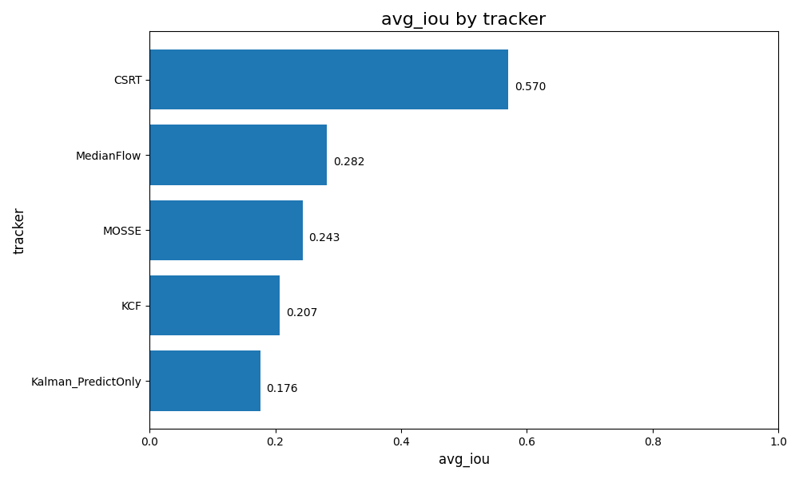
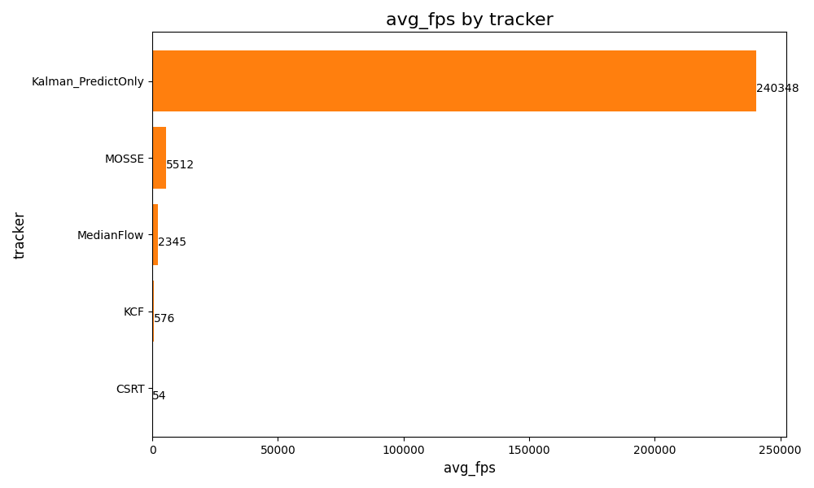
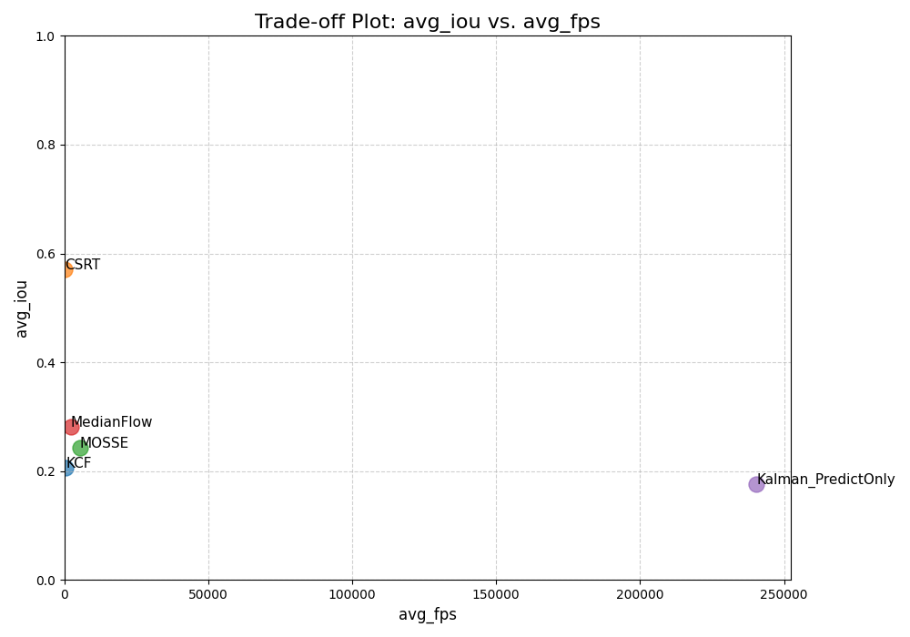

# Object Tracking

So sánh hiệu năng các thuật toán Object Tracking trên bộ dữ liệu **OTB100**, kèm ứng dụng demo Gradio cho phép tracking trực tiếp trên video tùy chọn.

## Trackers được đánh giá

| Tracker | Avg. IoU | Avg. FPS |
|---|---|---|
| **CSRT** | 0.5702 | 54 |
| MedianFlow | 0.2819 | 2,345 |
| MOSSE | 0.2432 | 5,512 |
| KCF | 0.2070 | 576 |
| Kalman (Predict Only) | 0.1761 | 240,348 |

> CSRT đạt độ chính xác cao nhất (IoU 0.57) nhưng chậm nhất trong nhóm OpenCV tracker. MOSSE và Kalman cực nhanh nhưng kém chính xác.

## Cấu trúc dự án

```
├── object_tracking.py          # Module tracking chính (CSRT, KCF, MOSSE, MedianFlow)
├── gradio_app.py               # Ứng dụng demo Gradio
├── benchmark.py                # Benchmark các OpenCV tracker trên OTB100
├── benchmark_kalman.py         # Benchmark Kalman Filter (predict-only) trên OTB100
├── plot_results.py             # Vẽ biểu đồ so sánh từ kết quả CSV
├── results_summary.csv         # Kết quả tổng hợp
├── results_detailed.csv        # Kết quả chi tiết từng video
├── charts/                     # Biểu đồ so sánh
│   ├── chart_1a_iou_leaderboard.png
│   ├── chart_1b_fps_leaderboard.png
│   ├── chart_2_consolidated.png
│   └── chart_3_tradeoff_scatter.png
└── requirements.txt
```

## Cài đặt

```bash
pip install -r requirements.txt
```

**Yêu cầu:**
- Python 3.8+
- `opencv-contrib-python` (bắt buộc — bản `opencv-python` thường không có các tracker legacy)

## Sử dụng

### Demo Gradio

```bash
python gradio_app.py
```

1. Upload video
2. Chọn frame bắt đầu bằng slider
3. Click 2 điểm trên ảnh để vẽ bounding box
4. Chọn tracker (CSRT, KCF, MOSSE, MedianFlow)
5. Nhấn **RUN** → xem video kết quả và tải về

### Chạy Benchmark

```bash
# Benchmark các OpenCV tracker (cần OTB100 dataset)
python benchmark.py

# Benchmark Kalman Filter
python benchmark_kalman.py

# Vẽ biểu đồ từ kết quả
python plot_results.py
```

> **Lưu ý:** Cần tải bộ dữ liệu [OTB100](http://cvlab.hanyang.ac.kr/tracker_benchmark/) và đặt vào `OTB-dataset-main/OTB100/`.

## Kết quả Benchmark

### IoU Leaderboard



### FPS Leaderboard



### Trade-off: Accuracy vs Speed



## Chi tiết thuật toán

| Tracker | Mô tả |
|---|---|
| **CSRT** | Discriminative Correlation Filter với spatial reliability. Chính xác nhất nhưng chậm. |
| **KCF** | Kernelized Correlation Filter. Cân bằng giữa tốc độ và độ chính xác. |
| **MOSSE** | Minimum Output Sum of Squared Error. Cực nhanh, phù hợp real-time. |
| **MedianFlow** | Dựa trên Lucas-Kanade optical flow. Phát hiện tracking failure tốt. |
| **Kalman Filter** | Chỉ dùng predict (không correct). Baseline cho so sánh — không dùng thông tin visual. |
